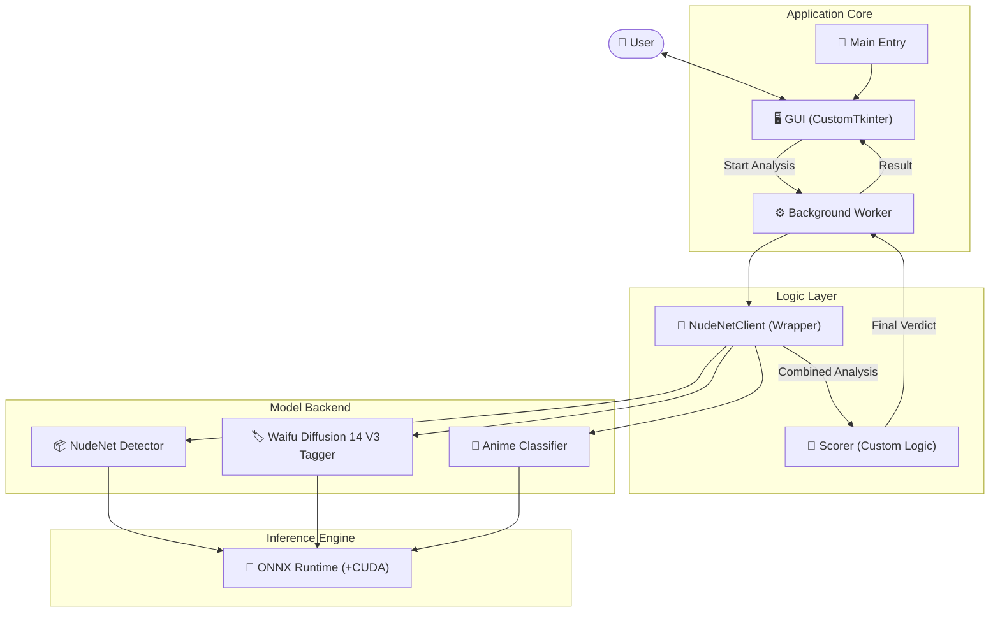
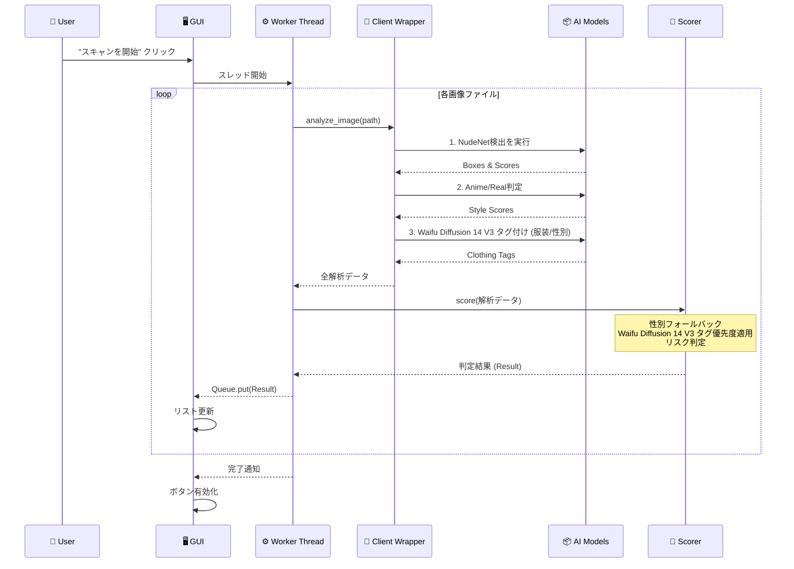

# chk-NudeNet-local (On-Premise NSFW Checker)

`NudeNet` および `Waifu Diffusion 14 V3 (WD14-Tagger V3, EVA02-Large)` を活用した、**完全オンプレミス（ローカル完結）** の NSFW 画像チェックアプリケーションです。  
外部APIを使用せず、ローカルマシンのリソースのみで高速かつ安全に画像判定を行います。様々な服装やシチュエーション（和服、メイド、制服など）を高精度に識別します。

<!-- *(※ここにスクリーンショットなどを貼ると分かりやすいです)* -->


## ✨ 主な特徴 (Features)

### 🔒 プライバシーとセキュリティ
- **完全ローカル実行**: 画像データが外部サーバーに送信されることは一切ありません。
- **オフライン動作**: 初回のモデルダウンロード以降は、インターネット接続なしで動作します。

### 🧠 高度なマルチモデル判定 (Multi-Model Analysis)
本アプリは3つの異なるAIモデルを統合して判定を行います。
1. **NudeNet Detector**: 露出部位（胸、性器など）の物体検出。
2. **Waifu Diffusion 14 V3 Tagger (WD14-Tagger V3)**: 10,000種類以上のタグ（服装、性別、シチュエーション）を高精度に分類。
3. **Anime Classifier**: アニメ/実写の画風判定。

### 🖥️ 高機能 GUI
- **モダンなインターフェース**: `CustomTkinter` を採用したダークモード対応の美しいUI。
- **最適化されたプレビュー**: 
  - 画像のアスペクト比を維持したまま、枠内に収まるよう自動調整。
  - **詳細リスク表示**: 検出されたリスクを `🔴` `🟡` `🟢` の色付きアイコンで直感的に表示。
  - **特になし**: リスクがない場合は「特になし」と表示し、視認性を向上。
- **リスト表示の最適化**: 画面領域を最大限に活用し、大量の画像も一覧性良く表示。
- **リソースモニター**: CPU、GPU、VRAMの使用率をリアルタイムで監視。

### ⚙️ 判定ロジックの詳細 (Advanced Logic)
単純なスコア判定だけでなく、独自の後処理ロジックで誤判定を抑制しています。

1.  **Waifu Diffusion 14 V3 タグ優先のスタイル判定**:
    - **性別判定**: NudeNetで顔が検出されない場合、Waifu Diffusion 14 V3 のタグ（`1girl`, `1boy` 等）を使用して性別を推定。
    - **服装認識**: `kimono` (和服)、`maid` (メイド)、`school uniform` (制服) などを認識し、露出判定の文脈を補正。
2.  **特異点オーバーライド**: `nipples` (乳首) が **93%** 以上で検出された場合、他の要素に関わらず `UNSAFE` (裸) と判定。
3.  **アニメ/実写の自動識別**: Waifu Diffusion 14 V3 タグ (`anime`, `realistic`) と NudeNet のスコアを比較し、より確信度の高い方を採用。

## 🛠️ アーキテクチャ (Architecture)



## 🔄 処理フロー (Sequence)



## 🚀 セットアップ (Setup)

### 必要要件
- Windows 10/11 (推奨)
- Python 3.10+
- (Optional) NVIDIA GPU + CUDA (GPU高速化のため推奨)

### インストール

1. リポジトリをクローンまたはダウンロードします。
2. 依存パッケージをインストールします。

```bash
pip install -r requirements.txt
```

※ 初回起動時、必要なモデルファイル（`.onnx`）が自動的にダウンロードされる場合があります。

## 🖱️ 使用方法 (Usage)

### GUI モード (推奨)

```bash
python main.py
```
1. **「フォルダを一括選択」** または **「ファイルを個別に選択」** で画像を読み込みます。
2. **「スキャンを開始」** ボタンを押します。
3. 判定が完了すると、リストに以下の情報が表示されます：
   - **判定(スコア)**: 安全度（SAFE〜UNSAFE）。
   - **スタイル**: 服装（裸、水着、下着、和服、メイドなど）。Waifu Diffusion 14 V3 タグによる分類。
   - **性別**: 女/男/不明（Waifu Diffusion 14 V3 タグによる補正あり）。
   - **詳細ラベル**: 検出された具体的なリスク部位。

### CLI モード (バッチ処理用)

```bash
python main.py ./path/to/images --recursive
```

## 📊 判定基準詳細

このアプリは、**NudeNet の物体検出スコア** と **WD14 の服装タグ** を総合的に評価して判定を行います。単なるスコアだけでなく、**スタイル（裸、下着、水着など）** も重要な判断基準となります。特に、乳首（nipples）や性器（pussy）タグの高確信度検出時には、自動的に UNSAFE（危険）と判定されます。

| カテゴリ | スコア範囲 | 説明 |
| :--- | :--- | :--- |
| **SAFE** | 0-20% | 安全。露出がほとんどない、または通常の服装。NSFW 部位の検出が低く、スタイルも着衣。 |
| **LOW_RISK** | 20-40% | 低リスク。水着や露出度の高い私服など。軽度の露出があるが、危険度は低い。 |
| **MODERATE** | 40-60% | 中リスク。下着姿、または際どい衣装。部分的な露出が検出される場合。 |
| **HIGH_RISK** | 60-80% | 高リスク。部分的な露出や、明示的な性的タグの検出。スタイルが下着や裸寄りの場合。 |
| **UNSAFE** | 80-100% | 危険。完全な裸体、乳首・性器の露出、または `nipples` (>=92%) / `pussy` (>=90%) タグの高確信度検出。 |

**注意**: 判定は最大スコアに基づき計算されますが、スタイル（Waifu Diffusion 14 V3 タグ）によるオーバーライドが適用される場合があります。例えば、NudeNet スコアが低くても、タグで「裸」と判定されれば UNSAFE になる可能性があります。

## License
MIT License
