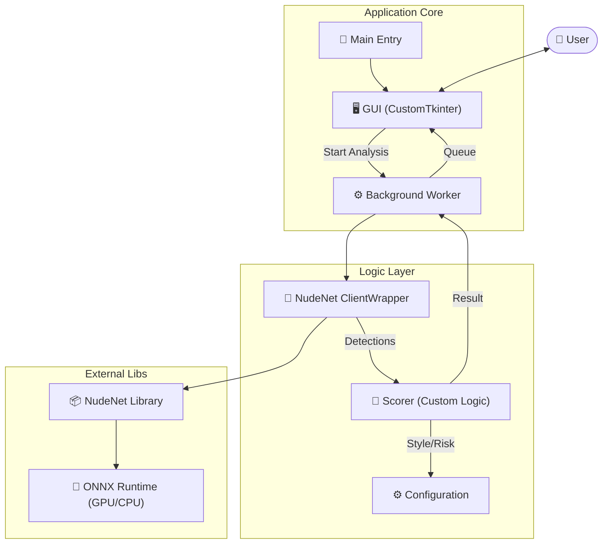
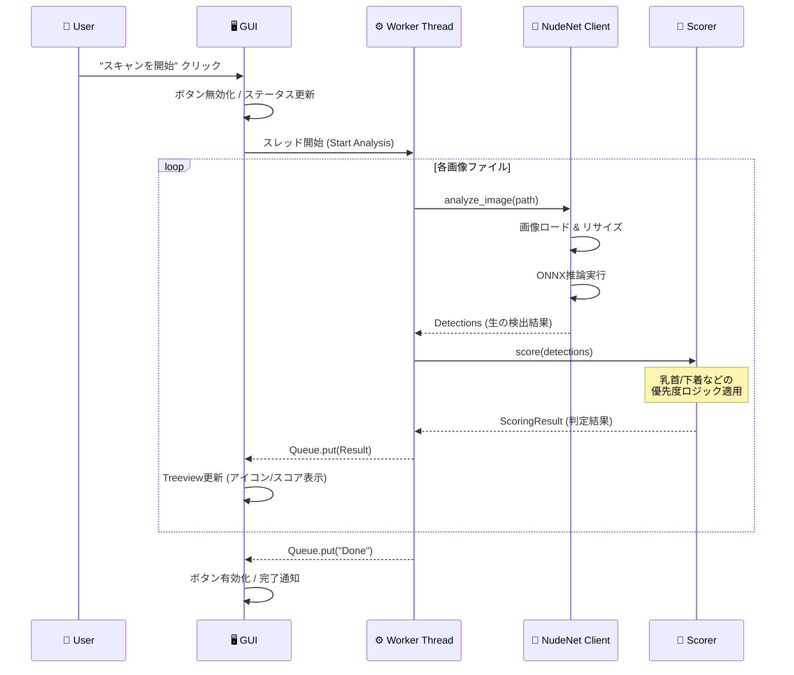

# chk-NudeNet-local (On-Premise NSFW Checker)

`NudeNet` を活用した、**完全オンプレミス（ローカル完結）** の NSFW 画像チェックアプリケーションです。  
外部APIを使用せず、ローカルマシンのリソースのみで高速かつ安全に画像判定を行います。

 
*(※ここにスクリーンショットなどを貼ると分かりやすいです)*

## ✨ 主な特徴 (Features)

### 🔒 プライバシーとセキュリティ
- **完全ローカル実行**: 画像データが外部サーバーに送信されることは一切ありません。
- **オフライン動作**: 初回のモデルダウンロード以降は、インターネット接続なしで動作します。

### 🖥️ 高機能 GUI
- **モダンなインターフェース**: `CustomTkinter` を採用したダークモード対応の美しいUI。
- **リアルタイムプレビュー**: 
  - 選択した画像のプレビュー表示（解像度・ファイルサイズ付き）。
  - **詳細リスク表示**: 検出された部位（胸、性器など）を `🔴危険` `🟡注意` `🟢安全` の色付きアイコンで直感的に表示。
- **リソースモニター**: CPU、GPU、VRAMの使用率をリアルタイムで監視。
- **堅牢な操作性**: スキャンの中断・再開がスムーズに行え、エラー時もUIがフリーズしません。

### 🧠 高度な判定ロジック (Advanced Logic)
単純な NudeNet の出力だけでなく、独自の後処理ロジックで誤判定を抑制し、特定のスタイルを正確に分類します。

1.  **スタイル優先度 (Style Hierarchy)**:
    - **特異点オーバーライド**: `nipples` (乳首) が **93%** 以上で検出された場合、他の服を着ていても強制的に `UNSAFE` (裸) と判定。
    - **下着優先**: `underwear`/`panties` が **90%** 以上の場合、`和服` や `制服` よりも `下着` スタイルを優先。
    - **特定の服装認識**:
        - 👘 **和服 (Kimono/Yukata)**: 胸元の露出があっても誤判定しないよう補正。
        - 🎀 **メイド (Maid)**: `maid` タグを検出し、専用カテゴリとして分類。
        - 👗 **ドレス/ワンピース**: 肌色が多くてもドレス判定を優先。
        - 🏫 **制服 (School Uniform)**: セーラー服やブレザーを認識。
2.  **マルチタグ判定**: 単独では弱い判定でも、複数の性的タグ（`cleavage` + `belly` 等）が組み合わさった場合にリスクスコアを加算。

## 🛠️ アーキテクチャ (Architecture)



## 🔄 処理フロー (Sequence)



## 🚀 セットアップ (Setup)

### 必要要件
- Windows 10/11 (推奨)
- Python 3.10+
- (Optional) NVIDIA GPU + CUDA (GPU高速化のため推奨)

### インストール

1. リポジトリをクローンまたはダウンロードします。
2. 依存パッケージをインストールします。

```bash
pip install -r requirements.txt
```

※ 初回起動時、NudeNet は自動的にモデルファイル（`.onnx`）を `~/.NudeNet/` にダウンロードします。

## 🖱️ 使用方法 (Usage)

### GUI モード (推奨)

```bash
python main.py
```
1. **「フォルダを一括選択」** または **「ファイルを個別に選択」** で画像を読み込みます。
2. **「スキャンを開始」** ボタンを押します。
3. 判定が完了すると、リストに結果が表示されます。行をクリックすると詳細プレビューが確認できます。

### CLI モード (バッチ処理用)

```bash
python main.py ./path/to/images --recursive
```

## 📊 判定基準詳細

| カテゴリ | 説明 |
| :--- | :--- |
| **SAFE** | 安全。露出がほとんどない、または通常の服装。 |
| **LOW_RISK** | 低リスク。水着や露出度の高い私服など。 |
| **MODERATE** | 中リスク。下着姿、または際どい衣装。 |
| **HIGH_RISK** | 高リスク。部分的な露出や、明示的な性的タグの検出。 |
| **UNSAFE** | 危険。完全な裸体、または乳首・性器の露出。 |

## License
MIT License
